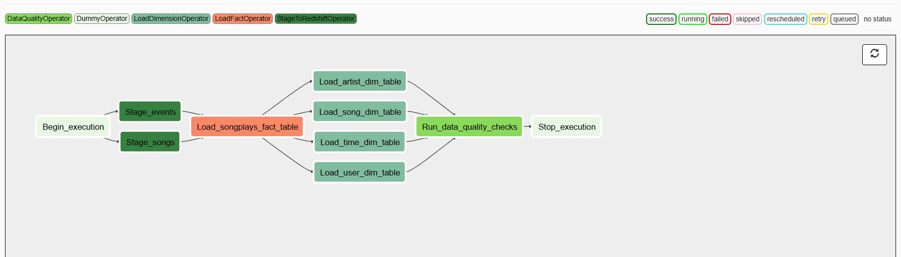

# Data Pipelines with Apache Airflow

## Task:
To complete the project, you will need to create your own custom operators to perform tasks such as staging the data, filling the data warehouse, and running checks on the data as the final step.

## Project Setup

1. Install Airflow, create variable AIRFLOW_HOME and AIRFLOW_CONFIG with the appropriate paths, and place dags and plugins on airflow_home directory.
2. Initialize Airflow data base with `airflow initdb`, and open webserver with `airflow webserver`
3. Access the server `http://localhost:8080` and create:

**AWS Connection**
Conn Id: Enter aws_credentials.
Conn Type: Enter Amazon Web Services.
Login: Enter your Access key ID from the IAM User credentials you downloaded earlier.
Password: Enter your Secret access key from the IAM User credentials you downloaded earlier.

**Redshift Connection**
Conn Id: Enter redshift.
Conn Type: Enter Postgres.
Host: Enter the endpoint of your Redshift cluster, excluding the port at the end.
Schema: This is the Redshift database you want to connect to.
Login: Enter awsuser.
Password: Enter the password created when launching the Redshift cluster.
Port: Enter 5439.

## Data Source
* Log data: `s3://udacity-dend/log_data`
* Song data: `s3://udacity-dend/song_data`

## DAG
DAG parameters:

* The DAG does not have dependencies on past runs
* DAG has schedule interval set to hourly
* On failure, the task are retried 3 times
* Retries happen every 5 minutes
* Catchup is turned off
* Email are not sent on retry

### Task dependencies
<figure>
  
</figure>
